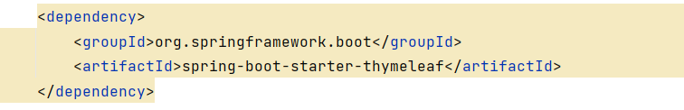
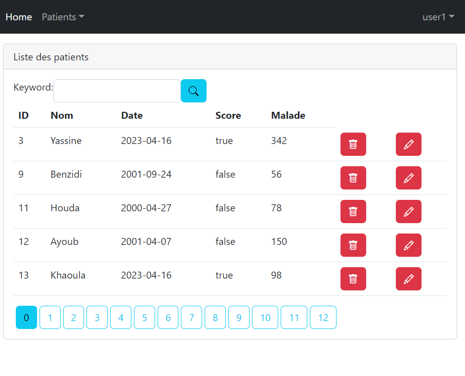
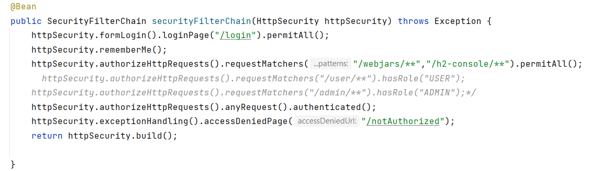
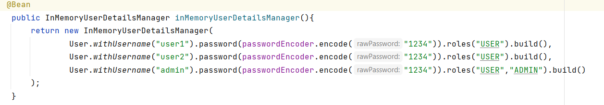
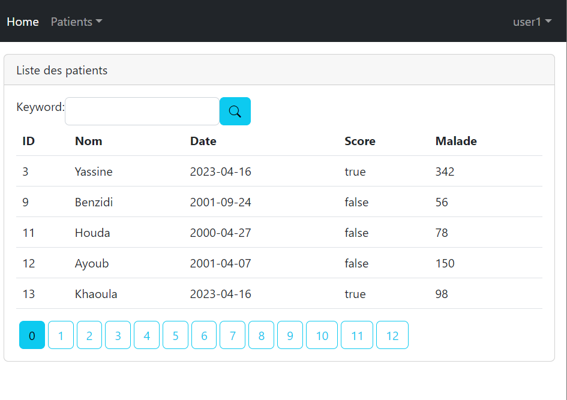
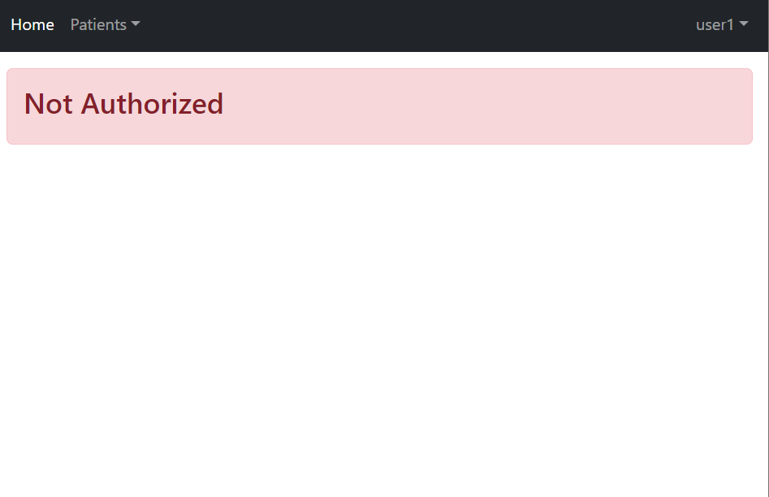

#hospital-app
<h1>Compte rendu de Spring Security</h1>
<h4>L'ajout de la dépendance Spring Security dans le fichier Pom.xml</h4>

Spring Security exige par la suite une authentification pour toutes les requêttes du serveur

<h4>Spring affiche un formulaire par defaut</h4>

On doit s'authentifer dans un premier lieu avec un compte par defaut en utilisant user comme login et un mot de passe générer automatiquement par Spring 

<h4>Interface utilisateur</h4>

<h4>Personnalisation de la configuration</h4>

Dans cette methode(Filter) on a interdit toutes les opérations, et on a exigé l'authentification

<h4>Spécification des utilisateurs qui ont le droit d'accèder à l'application</h4>

Ici on a definit quelques utilisateurs avec des mots de passe encoder

<h4>l'Ajout de Logout</h4>

<h4>Personnalisation du formulaire d'authentification</h4>

<h4>La gestion des autorisations</h4>

Dans cette partir on a retiré aux utilisateurs normaux les droits de gestion des patient

<h4>L'ajout de la page NotAuthorized</h4>

